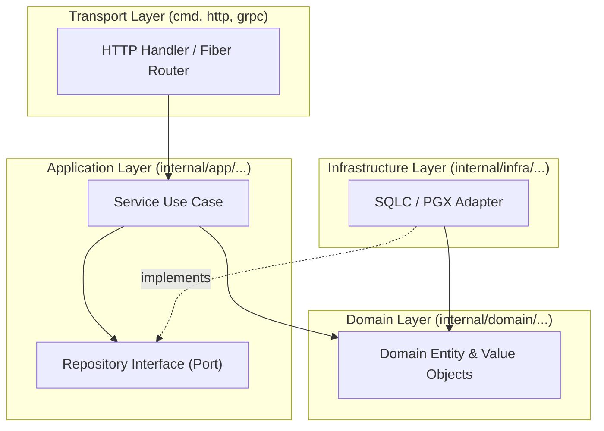
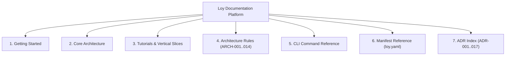

# Documentation Platform and Automated CLI Reference for Loy

**Document:** Research & Implementation Blueprint  
**Target Output:** `docs/research/documentation-platform-and-cli-docgen.md`  
**Date:** September 2026  
**Status:** Approved Specification & Architecture Guide  

---

## Executive Summary

This research specification establishes the architecture, tooling, and implementation blueprint for Loy's public documentation platform and automated CLI reference generator. 

Loy adheres strictly to two architectural principles that directly influence documentation engineering:
1. **Zero Runtime Dependency ([ADR-002](../adrs/ADR-002-minimal-runtime.md))**: The public site and developer documentation must run without proprietary SaaS search backends or bloated client-side runtimes.
2. **Deterministic Architecture & Codegen ([ADR-007](../adrs/ADR-007-plan-based-generation.md))**: Command documentation must be generated deterministically from single-source-of-truth Cobra command definitions (`cmd/loy` and `internal/cli`) into typed, searchable static pages.

To satisfy these invariants, the documentation platform evaluates and couples two primary sources:
1. **Astro Starlight** as the static documentation engine, providing zero-JS SSR/SSG, built-in client-side Pagefind search (requiring zero external SaaS dependencies), Expressive Code highlighting, tabs, callouts, and client-side Mermaid rendering.
2. **`github.com/spf13/cobra/doc`** as the CLI reference extraction engine, customized with frontmatter injection, semantic link rewrites, duplicate heading neutralization, and git-churn suppression.

---

## 1. Primary Source: Astro Starlight Documentation Engine

**Primary Source Specification:** [Starlight Documentation](https://starlight.astro.build/) and [Astro Documentation](https://docs.astro.build/).

### 1.1 Core Architectural Capabilities

| Capability | Starlight Implementation | Invariant Alignment for Loy |
|---|---|---|
| **Zero-JS SSG/SSR** | Built upon Astro Islands architecture. Content pages compile to pure static HTML and CSS by default. JavaScript is only hydrated when interactive components (e.g. search, tabs) demand it. | Aligns with ADR-002 (Minimal Runtime). Documentation is lightweight, blazingly fast on edge CDN networks, and functional with JavaScript disabled. |
| **Built-in Pagefind Search** | Starlight integrates [Pagefind](https://pagefind.app/) out of the box. During `astro build`, Pagefind indexes static HTML client-side into static chunked webassembly/wasm indexes. | **Zero SaaS Dependency**: No Algolia or external search cluster needed. Search works offline, in air-gapped corporate environments, and locally during development. |
| **Expressive Code** | Built-in integration with [Expressive Code](https://expressive-code.com/) for syntax highlighting (Shiki), line markers (`{2-4}`), word markers (`"foo"`), insertion/deletion diff markers (`ins=`, `del=`), and terminal window frames. | Provides high-fidelity code display for Go source snippets, DDL migrations, and CLI command terminal transcripts. |
| **Tabbed Interfaces (`<Tabs>`)** | Built-in `<Tabs>` and `<TabItem>` components with cross-page `syncKey` state persistence. | Allows users to toggle between Package Managers (pnpm/npm/yarn) or CLI modes (`loy make crud` vs manual layers) across all pages simultaneously. |
| **Callouts & Asides** | Native markdown syntax: `:::note`, `:::tip`, `:::caution`, `:::danger`, supporting custom titles (`:::tip[Custom Title]`) and custom icons. | Matches Loy diagnostic severity levels (`INFO`, `WARN`, `ERROR`, `HINT`). |
| **Mermaid Diagramming** | Integration via `astro-mermaid` or remark/rehype pipelines for client-side SVG rendering with automatic theme synchronization. | Visualizes Loy 4-layer architecture matrices, package dependency DAGs, and lifecycle supervision trees without static image compilation steps. |

### 1.2 Site Search (Pagefind) Mechanics

Pagefind requires **zero configuration** in Starlight. During the build step:
1. Astro renders all markdown pages in `src/content/docs/` to static HTML in `dist/`.
2. Starlight invokes Pagefind post-build, generating a sharded index in `dist/pagefind/`.
3. The Starlight frontend loads an ultra-compact UI bundle (`pagefind.js` ~12KB gzip) only when the user opens the search modal (`Ctrl+K` or `Cmd+K`).

To fine-tune search indexing:
- **Exclude a page from search**: Add `pagefind: false` to frontmatter.
- **Exclude specific DOM elements**: Add the `data-pagefind-ignore` attribute:
  ```html
  <div data-pagefind-ignore>
    Internal build metadata not for public search.
  </div>
  ```

### 1.3 Expressive Code Block Features

Starlight incorporates Expressive Code syntax extensions directly into standard Markdown code fences:

````markdown
```go title="internal/app/wiring.go" {4-6} ins="repo := postgres.NewUserRepository(db)"
func InitializeApp(ctx context.Context, cfg *Config) (*Application, error) {
    db, err := postgres.NewDB(cfg.DatabaseURL)
    if err != nil {
        return nil, err
    }
    repo := postgres.NewUserRepository(db)
    svc := user.NewService(repo)
    return &Application{UserService: svc}, nil
}
```
````

Features utilized for Loy docs:
- `title="path/to/file.go"`: Renders an IDE-style tab frame.
- `{4-6}`: Highlights lines 4 through 6 with neutral accent.
- `ins="..."` and `del="..."`: Highlights added or deleted statements with green/red backgrounds.
- `frame="terminal"` (or shell fences `bash`): Renders a macOS-style terminal frame with copy button.

### 1.4 Tabbed Interfaces and State Synchronization

The `<Tabs>` component enables tab switching across documentation pages:

```mdx
import { Tabs, TabItem } from '@astrojs/starlight/components';

<Tabs syncKey="go-toolchain">
  <TabItem label="Standard Go CLI" icon="seti:go">
    ```bash
    go run ./cmd/loy dev
    ```
  </TabItem>
  <TabItem label="Compiled Binary" icon="terminal">
    ```bash
    loy dev
    ```
  </TabItem>
</Tabs>
```

When `syncKey="go-toolchain"` is set, selecting "Compiled Binary" on any page persists the choice in browser `localStorage`, synchronizing all tabbed blocks across the entire site.

### 1.5 Mermaid Diagram Integration

Using `astro-mermaid`, Mermaid diagrams are defined in native markdown fences and rendered client-side with zero external API calls:

````markdown

````

`astro-mermaid` automatically monitors `html[data-theme]` or `body[data-theme]`. When the reader switches between dark and light mode in the Starlight navbar, the Mermaid diagrams re-render instantly with theme-matching palette colors (`dark` vs `default`).

### 1.6 Project Layout Specification

In accordance with modern Astro 5+ / Starlight Content Layer standards, the documentation workspace is organized as follows:

```text
loy-docs/
├── astro.config.mjs               # Astro + Starlight + Mermaid configuration
├── package.json                   # Dependencies: astro, @astrojs/starlight, astro-mermaid, mermaid
├── tsconfig.json                  # TypeScript compiler settings
├── wrangler.jsonc                 # Cloudflare deployment manifest (optional)
├── public/
│   ├── favicon.svg                # Loy icon
│   └── CNAME                      # Custom domain (for GitHub Pages)
├── src/
│   ├── assets/
│   │   └── loy-banner.png         # OpenGraph preview images
│   ├── content.config.ts          # Astro Content Layer collection definitions
│   ├── styles/
│   │   └── custom.css             # Brand color variables and typography overrides
│   └── content/
│       └── docs/
│           ├── index.mdx          # Homepage / Landing page
│           ├── getting-started/   # Installation, quickstart, concepts
│           ├── architecture/      # 4-layer invariants, ADR summaries
│           ├── tutorials/         # loy new, loy make crud, migrations
│           ├── rules/             # ARCH-001 through ARCH-014 rule catalog
│           ├── manifest/          # loy.yaml specification and schema
│           └── reference/
│               └── cli/           # Automated Cobra CLI reference output
```

#### Content Collections Configuration (`src/content.config.ts`)

```typescript
import { defineCollection } from 'astro:content';
import { docsLoader } from '@astrojs/starlight/loaders';
import { docsSchema } from '@astrojs/starlight/schema';

export const collections = {
  docs: defineCollection({
    loader: docsLoader(),
    schema: docsSchema(),
  }),
};
```

#### Astro & Starlight Configuration (`astro.config.mjs`)

```javascript
import { defineConfig } from 'astro/config';
import starlight from '@astrojs/starlight';
import mermaid from 'astro-mermaid';

export default defineConfig({
  site: 'https://loy.dev',
  integrations: [
    // astro-mermaid must be registered before starlight to process markdown AST
    mermaid({
      theme: 'default',
      autoTheme: true,
      mermaidConfig: {
        flowchart: { curve: 'basis' },
      },
    }),
    starlight({
      title: 'Loy Developer Platform',
      logo: {
        src: './src/assets/loy-logo.svg',
      },
      social: {
        github: 'https://github.com/loy-go/loy',
      },
      customCss: ['./src/styles/custom.css'],
      sidebar: [
        {
          label: 'Getting Started',
          items: [
            { slug: 'getting-started/installation' },
            { slug: 'getting-started/quickstart' },
            { slug: 'getting-started/core-concepts' },
          ],
        },
        {
          label: 'Architecture & Invariants',
          items: [
            { slug: 'architecture/overview' },
            { slug: 'architecture/layers' },
            { slug: 'architecture/wiring' },
            { slug: 'architecture/adrs' },
          ],
        },
        {
          label: 'Tutorials & Slices',
          items: [
            { slug: 'tutorials/rest-crud' },
            { slug: 'tutorials/database-migrations' },
            { slug: 'tutorials/fullstack-ssr' },
          ],
        },
        {
          label: 'Architecture Rules',
          autogenerate: { directory: 'rules' },
        },
        {
          label: 'CLI Command Reference',
          autogenerate: { directory: 'reference/cli' },
        },
        {
          label: 'Manifest Reference',
          items: [{ slug: 'manifest/loy-yaml' }],
        },
      ],
      expressiveCode: {
        themes: ['github-dark', 'github-light'],
        styleOverrides: {
          borderRadius: '0.5rem',
        },
      },
    }),
  ],
});
```

### 1.7 Deployment Pipelines

#### Target A: GitHub Pages (via GitHub Actions)

Create `.github/workflows/deploy-docs.yml`:

```yaml
name: Deploy Documentation to GitHub Pages

on:
  push:
    branches: [main]
    paths:
      - 'docs/**'
      - 'loy-docs/**'
  workflow_dispatch:

permissions:
  contents: read
  pages: write
  id-token: write

concurrency:
  group: 'pages'
  cancel-in-progress: true

jobs:
  build:
    runs-on: ubuntu-latest
    steps:
      - name: Checkout Repository
        uses: actions/checkout@v4

      - name: Setup Node.js
        uses: actions/setup-node@v4
        with:
          node-version: 22
          cache: 'pnpm'
          cache-dependency-path: 'loy-docs/pnpm-lock.yaml'

      - name: Install pnpm
        uses: pnpm/action-setup@v3
        with:
          version: 9

      - name: Install Dependencies
        run: pnpm install --frozen-lockfile
        working-directory: loy-docs

      - name: Build Docs Platform
        run: pnpm run build
        working-directory: loy-docs

      - name: Upload Pages Artifact
        uses: actions/upload-pages-artifact@v3
        with:
          path: loy-docs/dist

  deploy:
    needs: build
    runs-on: ubuntu-latest
    environment:
      name: github-pages
      url: ${{ steps.deployment.outputs.page_url }}
    steps:
      - name: Deploy to GitHub Pages
        id: deployment
        uses: actions/deploy-pages@v4
```

#### Target B: Cloudflare Pages / Workers (Edge Hosting)

For Cloudflare static deployments, create `wrangler.jsonc` in `loy-docs/`:

```jsonc
{
  "$schema": "node_modules/wrangler/config-schema.json",
  "name": "loy-docs",
  "compatibility_date": "2026-09-01",
  "assets": {
    "directory": "./dist",
    "not_found_handling": "404-page"
  }
}
```

Deploy step in CI:
```bash
npx wrangler deploy --project-name=loy-docs
```

---

## 2. Primary Source: Cobra Documentation Engine (`cobra/doc`)

**Primary Source Specification:** [`github.com/spf13/cobra/doc`](https://pkg.go.dev/github.com/spf13/cobra/doc) and [Cobra Source Code](https://github.com/spf13/cobra/tree/main/doc).

### 2.1 Cobra Doc API Mechanics

The official Cobra documentation generator provides:

```go
package doc

// GenMarkdownTree generates markdown files for cmd and all descendants in dir.
func GenMarkdownTree(cmd *cobra.Command, dir string) error

// GenMarkdownTreeCustom provides custom file prepending and link rewriting hooks.
func GenMarkdownTreeCustom(
    cmd *cobra.Command, 
    dir string, 
    filePrepender func(string) string, 
    linkHandler func(string) string,
) error

// GenMarkdownCustom writes a single command's markdown documentation to an io.Writer.
func GenMarkdownCustom(cmd *cobra.Command, w io.Writer, linkHandler func(string) string) error
```

#### How `GenMarkdownTreeCustom` Operates Internally:
1. It traverses all children where `child.IsAvailableCommand() && !child.IsAdditionalHelpTopicCommand()`.
2. Computes the output filename as:
   $$\text{basename} = \text{strings.ReplaceAll}(cmd.\text{CommandPath}(), \text{" "}, \text{"\_"}) + \text{".md"}$$
   Examples: `loy.md`, `loy_make.md`, `loy_make_crud.md`.
3. Calls `filePrepender(filename)` and writes its returned string at byte offset 0.
4. Calls `GenMarkdownCustom`, which writes:
   - `## ` followed by `cmd.CommandPath()`
   - Short description (`cmd.Short`)
   - `### Synopsis` and long description (`cmd.Long`)
   - Syntax usage block (```` ```\ncmd.UseLine()\n``` ````)
   - `### Examples` if defined
   - `### Options` (formatted via `pflag.PrintDefaults()`)
   - `### Options inherited from parent commands`
   - `### SEE ALSO` containing Markdown links to parent and children
   - If `!cmd.DisableAutoGenTag`, a footer: `###### Auto generated by spf13/cobra on <Date>`

### 2.2 Impedance Mismatch Between Cobra Markdown and Astro Starlight

Default Cobra Markdown generation causes three key defects in Starlight:

| Defect in Default Output | Root Cause in `cobra/doc` | Impact in Astro Starlight | Remediation Strategy |
|---|---|---|---|
| **Missing Frontmatter** | `GenMarkdownTree` outputs raw markdown without YAML frontmatter delimiters (`---`). | Starlight rejects the page during content collection validation or fails to extract title/description. | Implement `filePrepender` to inject valid YAML frontmatter with `title`, `description`, and `slug`. |
| **Duplicate Page Headings** | Line 64 of `md_docs.go` outputs `## <command_path>`. Starlight also renders `<h1><frontmatter.title></h1>`. | The page displays a redundant `<h1>` immediately followed by an identical `<h2>`, cluttering the table of contents. | Neutralize or strip the leading `## <command_path>` during generation or via custom writer. |
| **Broken Markdown Links** | Line 90 & 108 generate links using raw file basenames (e.g. `loy_make.md`). | In Starlight's routed URL hierarchy, relative `.md` links fail 404 unless transformed to site routes. | Implement `linkHandler` to transform `loy_make_crud.md` into `/reference/cli/loy-make-crud/`. |
| **Git Diff Noise** | Cobra appends a generation timestamp comment at the end of every file. | Every execution of `docgen` modifies timestamps across all files, creating meaningless merge conflicts. | Recursively enforce `cmd.DisableAutoGenTag = true` across the entire command tree. |
| **Raw Flag Formatting** | Cobra wraps flag listings in raw text blocks without language tags. | Expressive Code cannot style or syntax-highlight the options cleanly. | Format flags or configure Expressive Code to render shell options cleanly. |

### 2.3 Dependency Note Regarding `github.com/spf13/cobra/doc`

Importing `github.com/spf13/cobra/doc` introduces a transitive dependency on `github.com/cpuguy83/go-md2man/v2` (used for troff/man-page formatting within the same package). 

In accordance with **ADR-002 (Minimal Runtime)** and Loy's core invariants:
- The production Loy binary (`bin/loy`) must not link `cobra/doc` or `go-md2man`.
- Doc generation must reside in a dedicated developer tool: `cmd/docgen/main.go`.

### 2.4 Production Implementation: `cmd/docgen/main.go`

Here is the complete, production-grade Go tool implementing the custom prepender, route transformer, heading sanitizer, and command indexer:

```go
// Package main generates Astro Starlight-compatible Markdown documentation
// for all Loy CLI commands and subcommands.
package main

import (
	"bytes"
	"flag"
	"fmt"
	"io"
	"os"
	"path/filepath"
	"strings"

	"github.com/spf13/cobra"
	"github.com/spf13/cobra/doc"
	"github.com/loy-go/loy/internal/cli"
	"github.com/loy-go/loy/internal/filesystem"
	"github.com/loy-go/loy/internal/process"
)

func main() {
	outDir := flag.String("out", "loy-docs/src/content/docs/reference/cli", "Directory to output markdown files")
	flag.Parse()

	if err := run(*outDir); err != nil {
		fmt.Fprintf(os.Stderr, "docgen error: %v\n", err)
		os.Exit(1)
	}
}

func run(outDir string) error {
	// Initialize the Loy root command tree using test doubles to avoid side-effects
	memFS := filesystem.NewMemFileSystem()
	mockRunner := process.NewMockRunner()
	rootCmd := cli.NewRootCmdWithFS(memFS, mockRunner)

	// Clean or create destination directory
	if err := os.MkdirAll(outDir, 0755); err != nil {
		return fmt.Errorf("creating directory %s: %w", outDir, err)
	}

	// 1. Build an index of all commands keyed by their expected doc filename
	cmdMap := make(map[string]*cobra.Command)
	disableTagsAndIndex(rootCmd, cmdMap)

	// 2. Define custom link handler: maps "loy_make_crud.md" -> "/reference/cli/loy-make-crud/"
	linkHandler := func(link string) string {
		base := strings.TrimSuffix(link, ".md")
		kebab := strings.ReplaceAll(base, "_", "-")
		return fmt.Sprintf("/reference/cli/%s/", kebab)
	}

	// 3. Define custom file prepender: injects Starlight-compliant frontmatter
	filePrepender := func(filePath string) string {
		base := filepath.Base(filePath)
		c, ok := cmdMap[base]
		if !ok {
			return ""
		}

		cmdPath := c.CommandPath()
		slug := strings.ReplaceAll(strings.ReplaceAll(cmdPath, " ", "-"), "_", "-")
		desc := escapeFrontmatter(c.Short)
		if desc == "" {
			desc = fmt.Sprintf("CLI reference for %s", cmdPath)
		}

		var buf strings.Builder
		buf.WriteString("---\n")
		buf.WriteString(fmt.Sprintf("title: \"%s\"\n", cmdPath))
		buf.WriteString(fmt.Sprintf("description: \"%s\"\n", desc))
		buf.WriteString(fmt.Sprintf("slug: reference/cli/%s\n", slug))
		buf.WriteString("sidebar:\n")
		buf.WriteString(fmt.Sprintf("  label: \"%s\"\n", c.Name()))
		buf.WriteString("---\n\n")

		return buf.String()
	}

	// 4. Generate markdown files using custom hooks
	if err := doc.GenMarkdownTreeCustom(rootCmd, outDir, filePrepender, linkHandler); err != nil {
		return fmt.Errorf("generating markdown tree: %w", err)
	}

	// 5. Post-process files to eliminate duplicate "## <command_name>" headers
	if err := sanitizeHeaders(outDir); err != nil {
		return fmt.Errorf("sanitizing markdown headers: %w", err)
	}

	fmt.Printf("Successfully generated CLI reference in %s\n", outDir)
	return nil
}

// disableTagsAndIndex sets DisableAutoGenTag recursively and builds the command map.
func disableTagsAndIndex(cmd *cobra.Command, index map[string]*cobra.Command) {
	cmd.DisableAutoGenTag = true

	base := strings.ReplaceAll(cmd.CommandPath(), " ", "_") + ".md"
	index[base] = cmd

	for _, child := range cmd.Commands() {
		if child.IsAvailableCommand() && !child.IsAdditionalHelpTopicCommand() {
			disableTagsAndIndex(child, index)
		}
	}
}

// sanitizeHeaders removes the duplicate "## command" heading generated by Cobra
// because Starlight's layout already renders frontmatter.title as an <h1>.
func sanitizeHeaders(dir string) error {
	entries, err := os.ReadDir(dir)
	if err != nil {
		return err
	}

	for _, entry := range entries {
		if entry.IsDir() || !strings.HasSuffix(entry.Name(), ".md") {
			continue
		}

		path := filepath.Join(dir, entry.Name())
		content, err := os.ReadFile(path)
		if err != nil {
			return err
		}

		// Split frontmatter from body
		parts := strings.SplitN(string(content), "---\n\n", 2)
		if len(parts) != 2 {
			continue
		}

		frontmatter := parts[0] + "---\n\n"
		body := parts[1]

		// If body begins with "## loy ...", strip that single line to prevent h1/h2 duplication
		lines := strings.Split(body, "\n")
		if len(lines) > 0 && strings.HasPrefix(lines[0], "## ") {
			body = strings.Join(lines[1:], "\n")
			// Trim any leading extra blank lines
			body = strings.TrimLeft(body, "\n")
		}

		updated := frontmatter + body
		if err := os.WriteFile(path, []byte(updated), 0644); err != nil {
			return err
		}
	}

	return nil
}

func escapeFrontmatter(s string) string {
	s = strings.ReplaceAll(s, `"`, `\"`)
	s = strings.ReplaceAll(s, "\n", " ")
	return strings.TrimSpace(s)
}
```

### 2.5 Makefile Integration

Add the `docgen` target to the project `Makefile`:

```makefile
.PHONY: docgen
docgen:
	@echo "==> Generating CLI reference documentation..."
	@go run ./cmd/docgen --out loy-docs/src/content/docs/reference/cli
```

---

## 3. Information Architecture (IA) Blueprint for Loy

To convert Loy's technical specifications (`docs/01-PRD.md` through `docs/22-Traceability-Roadmap.md`) and Architectural Decision Records into an approachable, high-converting public site, content is mapped into **7 primary categories**.



### 3.1 Category 1: Getting Started

*Target Audience:* New Go developers or teams migrating from Laravel, Rails, or NestJS looking for structured Go.

| Document Title | Slug Path | Source Spec Origin | Key Content & Outcomes |
|---|---|---|---|
| **Installation** | `getting-started/installation` | Doc 09, Doc 15 | Installing `loy` via `go install github.com/loy-go/loy/cmd/loy@latest`, Homebrew formula, or pre-built GitHub release binaries. Verifying installation with `loy doctor`. |
| **5-Minute Quickstart** | `getting-started/quickstart` | Doc 02, Doc 09 | Running `loy new my-app`, inspecting the generated clean architecture layout, running `loy dev`, and hitting `GET /healthz`. |
| **Core Philosophy** | `getting-started/core-concepts` | ADR-001, ADR-002, Doc 01 | Seams over components; zero runtime dependencies; why Loy avoids proprietary ORMs and web frameworks; explicit wiring over magic. |

### 3.2 Category 2: Core Architectural Invariants

*Target Audience:* Architects, staff engineers, and tech leads evaluating Loy's architectural integrity.

| Document Title | Slug Path | Source Spec Origin | Key Content & Invariants |
|---|---|---|---|
| **The 4-Layer Dependency Direction** | `architecture/layers` | Doc 05, Doc 13 | Strict layer flow: `Transport -> Application -> Domain <- Infrastructure`. Domain never imports infrastructure or transport. Consumer-owned interfaces. |
| **Explicit Wiring & Zero Reflection** | `architecture/wiring` | ADR-003, ADR-014 | How dependencies are wired via standard Go constructors in `internal/app/wiring.go`. Managed comment regions (`// loy:region:...`). Why reflection DI is banned. |
| **State Hygiene: No Mutable Globals** | `architecture/state-hygiene` | Doc 05, AGENTS.md | Package-level mutable variables are prohibited. Thread-safe design, passing configuration via explicit structs or `context.Context`. |
| **Workspace & Monorepo Topology** | `architecture/workspaces` | ADR-008, Doc 11 | Multi-application workspaces. Application-to-package allowed; application-to-application cross-imports strictly prohibited. |
| **Plan-Based Atomic Generation** | `architecture/plan-engine` | ADR-007, Doc 04 | How Loy generators build an in-memory `plan.Plan` and journal before touching the disk. Zero corrupted or half-written workspace state. |

### 3.3 Category 3: Tutorials & Vertical Slices

*Target Audience:* Day-to-day developers implementing product features.

| Tutorial Title | Slug Path | Source Spec Origin | Practical Workflow Demonstrated |
|---|---|---|---|
| **Building a REST CRUD Slice** | `tutorials/rest-crud` | Doc 04, Phase 5 | Running `loy make crud User name:string email:string:unique`. Examining the generated model, repository interface, Postgres adapter, service, HTTP handler, and wiring registration. |
| **Database Migrations & SQLC Pipeline** | `tutorials/database-migrations` | ADR-015, Doc 07 | Creating migration files (`loy migrate create`), applying migrations (`loy migrate up`), generating type-safe queries with `sqlc generate`. |
| **Fullstack SSR with Templ & HTMX** | `tutorials/fullstack-ssr` | ADR-006, ADR-013, Phase 9 | Generating server-rendered UI components (`loy make view`), compiling Templ templates, live reloading via `loy dev`. |
| **Background Jobs & Event Listeners** | `tutorials/jobs-and-events` | Doc 07, Doc 08 | Emitting domain events (`loy make event`), dispatching asynchronous queue tasks (`loy make job`), wiring handlers via Asynq. |
| **Production Packaging: Docker & Helm** | `tutorials/deployment` | Doc 18, Phase 10 | Generating container images (`loy make docker`) and production Kubernetes manifests (`loy make k8s`, `loy make helm`). |

### 3.4 Category 4: Architecture Enforcement Rules (`ARCH-001` through `ARCH-014`)

*Target Audience:* Developers running `loy check` or resolving CI pipeline failures.

Every rule page includes:
1. **Rule ID & Formal Statement**
2. **Rationale (The "Why")**
3. **Bad Code Example (Triggering `loy check` failure)**
4. **Good Code Example (Approved Remediation)**
5. **Suppression Policy (`loy:ignore`)**

#### Architecture Rule Catalog Summary Table

| Rule ID | Name & Description | Severity | Suppressible? | Diagnostic Code |
|---|---|---|---|---|
| `ARCH-001` | **Dependency Cycles Forbidden** | Error | **No** | `LOY-ARCH-001` |
| `ARCH-002` | **Domain Must Not Import Infrastructure** | Error | Yes | `LOY-ARCH-002` |
| `ARCH-003` | **Domain Must Not Import Transport** | Error | Yes | `LOY-ARCH-003` |
| `ARCH-004` | **Application Must Not Import Transport** | Error | Yes | `LOY-ARCH-004` |
| `ARCH-005` | **Application Must Not Import Concrete Infrastructure** | Error | Yes | `LOY-ARCH-005` |
| `ARCH-006` | **Infrastructure Must Not Import Transport** | Error | Yes | `LOY-ARCH-006` |
| `ARCH-007` | **Transport Must Not Contain Raw Persistence Logic** | Error | Yes | `LOY-ARCH-007` |
| `ARCH-008` | **Domain Must Not Import External Frameworks** | Error | Yes | `LOY-ARCH-008` |
| `ARCH-009` | **Forbidden Dependency Categories Per Layer** | Error | Yes | `LOY-ARCH-009` |
| `ARCH-010` | **Strict 4-Layer Dependency Direction Matrix** | Error | **No** | `LOY-ARCH-010` |
| `ARCH-011` | **Service Locators and Dynamic DI Banned** | Error | Yes | `LOY-ARCH-011` |
| `ARCH-012` | **Package-Level Mutable State Prohibited** | Error | Yes | `LOY-ARCH-012` |
| `ARCH-013` | **Workspace App-to-App Dependencies Forbidden** | Error | **No** | `LOY-ARCH-013` |
| `ARCH-014` | **Generated Code Location & Artifact Ownership** | Error | Yes | `LOY-ARCH-014` |

#### Representative Rule Deep-Dives for the Documentation Site

##### `ARCH-001`: Dependency Cycles Forbidden
- **Rule ID:** `ARCH-001`
- **Severity:** `Error` (Non-suppressible)
- **Rationale:** Package cycles make incremental compilation impossible, obscure domain boundaries, and prevent modular testing.
- **Violation:**
  ```go
  // package user imports package order
  import "github.com/acme/my-app/internal/order"
  
  // package order imports package user
  import "github.com/acme/my-app/internal/user"
  ```
- **Remediation:** Extract shared value types into a common domain package or use dependency inversion:
  ```go
  // package user defines narrow interface or consumer type
  type OrderSummary struct { ID string; Total int64 }
  ```

##### `ARCH-002`: Domain Must Not Import Infrastructure
- **Rule ID:** `ARCH-002`
- **Severity:** `Error` (Suppressible with reason)
- **Rationale:** The domain represents core enterprise business entities. It must remain pure Go, independent of SQL drivers, ORMs, key-value stores, or external third-party SDKs.
- **Violation:**
  ```go
  package domain

  import "github.com/jackc/pgx/v5" // VIOLATION: Domain imports database driver

  type User struct {
      ID pgx.Identifier
  }
  ```
- **Remediation:** Use standard Go primitive types in domain models and declare repository interfaces in domain or application:
  ```go
  package domain

  type User struct {
      ID string
      Email string
  }

  type UserRepository interface {
      FindByID(ctx context.Context, id string) (*User, error)
  }
  ```

##### `ARCH-005`: Application Must Not Import Concrete Infrastructure
- **Rule ID:** `ARCH-005`
- **Severity:** `Error` (Suppressible with reason)
- **Rationale:** Application use cases orchestrate domain entities and depend only on abstract ports (consumer-owned interfaces). Concrete infrastructure implementations (e.g. Postgres adapters) must be injected at application startup.
- **Violation:**
  ```go
  package service

  import "github.com/acme/my-app/internal/infrastructure/postgres" // VIOLATION

  type UserService struct {
      repo *postgres.UserRepositoryAdapter // Directly coupled to concrete Postgres
  }
  ```
- **Remediation:** Accept a consumer interface in constructor; inject concrete adapter in `internal/app/wiring.go`:
  ```go
  package service

  type UserRepository interface {
      FindByID(ctx context.Context, id string) (*domain.User, error)
  }

  type UserService struct {
      repo UserRepository // Consumes narrow interface
  }

  func NewUserService(repo UserRepository) *UserService {
      return &UserService{repo: repo}
  }
  ```

##### `ARCH-012`: Package-Level Mutable State Prohibited
- **Rule ID:** `ARCH-012`
- **Severity:** `Error` (Suppressible with reason)
- **Rationale:** Global variables introduce race conditions, prevent parallel unit testing, and conceal dependencies.
- **Violation:**
  ```go
  package database

  var DB *pgxpool.Pool // VIOLATION: Global mutable database connection
  ```
- **Remediation:** Encapsulate connection handles in structs; pass them through constructors:
  ```go
  package database

  type Adapter struct {
      pool *pgxpool.Pool
  }

  func NewAdapter(pool *pgxpool.Pool) *Adapter {
      return &Adapter{pool: pool}
  }
  ```

##### Suppression Mechanism Syntax
For temporary migrations, rules allowing suppression can be annotated with an explicit reason:
```go
// loy:ignore ARCH-005 reason="temporary legacy migration adapter pending Phase 2 refactor"
```

### 3.5 Category 5: CLI Command Reference (Auto-Generated)

*Target Audience:* Developers running shell commands. Generated via `cmd/docgen`.

#### Command Hierarchy Matrix

```text
loy
├── version                # Display binary version, commit, build date
├── doctor                 # Validate system toolchain (Go, git, sqlc, goose, docker)
├── init                   # Initialize Loy manifest in existing Go project
├── new <project>          # Scaffold new clean-architecture Loy project
├── dev                    # Start supervised multi-process development environment
├── check [path]           # Execute architecture validation engine
├── graph [path]           # Visualize dependency graph (dot, json, mermaid, text)
├── completion <shell>     # Generate shell completions (bash, zsh, fish, powershell)
├── make                   # Code generator tree
│   ├── crud <name>        # Vertical CRUD slice (model, repo, svc, handler, wiring)
│   ├── feature <name>     # Vertical business feature slice
│   ├── model <name>       # Domain entity model
│   ├── repository <name>  # Domain repository interface and infra adapter
│   ├── service <name>     # Application service use case
│   ├── handler <name>     # Transport HTTP handler
│   ├── request <name>     # Transport request DTO with validation
│   ├── resource <name>    # Transport API JSON resource transformer
│   ├── job <name>         # Asynchronous background job
│   ├── event <name>       # Domain event definition
│   ├── listener <name>    # Event listener handler
│   ├── policy <name>      # Authorization policy
│   ├── test <name>        # Unit and integration test scaffold
│   ├── view <name>        # Templ HTML view component
│   ├── docker             # Multi-stage Dockerfile
│   ├── k8s                # Kubernetes Deployment, Service, Ingress manifests
│   ├── helm               # Helm chart packaging
│   ├── ci                 # GitHub Actions or GitLab CI pipelines
│   └── runtime            # Production application lifecycle supervisor
└── migrate                # Database migration toolchain
    ├── create <name>      # Create timestamped SQL migration file
    ├── up                 # Apply all pending database migrations
    ├── down               # Rollback the most recent migration
    ├── status             # Display migration status and pending version count
    ├── redo               # Rollback and re-apply the latest migration
    ├── reset              # Rollback all migrations to version 0
    └── version            # Print current database schema version
```

### 3.6 Category 6: Manifest Reference (`loy.yaml`)

*Target Audience:* Developers configuring project settings, generator defaults, and architectural boundaries.

#### Complete Annotated Schema (`loy.yaml`)

```yaml
# Schema version
version: 1

# Project metadata
project:
  name: "acme-api"
  description: "Enterprise Order Management Service"
  module: "github.com/acme/acme-api"

# Default framework selections for code generators
defaults:
  http: "fiber"         # HTTP transport engine: fiber | chi | echo | standard
  database: "postgres"  # Database provider: postgres | mysql | sqlite
  cache: "valkey"       # Cache engine: valkey | redis | inmemory
  queue: "asynq"        # Background worker: asynq | watermill
  template: "templ"     # HTML template engine: templ
  assets: "vite"        # Frontend asset bundler: vite

# Infrastructure integrations and capability settings
integrations:
  database:
    driver: "postgres"
    enabled: true
    config:
      schema_path: "migrations"
      queries_path: "internal/infrastructure/persistence/queries"
  cache:
    driver: "valkey"
    enabled: true
    config:
      cluster: false
  telemetry:
    driver: "opentelemetry"
    enabled: true
    config:
      endpoint: "localhost:4317"

# Architectural engine governance overrides
architecture:
  strict: true          # Treat warnings as fatal errors in CI
  excluded:             # Package patterns excluded from layer checks
    - "tools/**"
    - "scripts/**"

# Multi-application workspace topology (for monorepos)
workspace:
  default_target: "apps/api"
  apps:
    - "apps/api"
    - "apps/worker"
  packages:
    - "packages/common"
    - "packages/events"
```

### 3.7 Category 7: ADR (Architectural Decision Record) Index

*Target Audience:* Core contributors, open-source maintainers, and security reviewers.

| ADR ID | Title | Status | Primary Decision & Invariant |
|---|---|---|---|
| [ADR-001](../adrs/ADR-001-seams-over-components.md) | **Seams over components** | Accepted | Loy standardizes architectural wiring between mature Go libraries; never invents proprietary ORMs or frameworks. |
| [ADR-002](../adrs/ADR-002-minimal-runtime.md) | **Minimal runtime** | Accepted | Generated applications run as ordinary Go binaries; zero runtime dependency on the Loy binary or CLI packages. |
| [ADR-003](../adrs/ADR-003-explicit-wiring.md) | **Explicit wiring** | Accepted | Dependencies injected via explicit Go constructors in `internal/app/wiring.go`. Service locators and reflection DI strictly banned. |
| [ADR-004](../adrs/ADR-004-build-time-first.md) | **Build-time first** | Accepted | Validation, verification, and code generation occur ahead-of-time at compile/build stage. |
| [ADR-005](../adrs/ADR-005-capabilities.md) | **Capabilities** | Accepted | Integrations modeled around abstract platform capabilities (database, cache, queue) rather than vendor lock-in. |
| [ADR-006](../adrs/ADR-006-typed-source-generation-with-templ.md) | **Typed generation** | Superseded | Evaluated Templ for all Go source codegen; superseded in part by ADR-013. |
| [ADR-007](../adrs/ADR-007-plan-based-generation.md) | **Plan-based generation** | Accepted | Generators compute an in-memory execution plan and journal before executing filesystem mutations. |
| [ADR-008](../adrs/ADR-008-go-workspace-authority.md) | **Go workspace authority** | Accepted | Standard Go tools (`go.mod`, `go.work`) remain authoritative for module resolution and multi-module builds. |
| [ADR-009](../adrs/ADR-009-progressive-complexity.md) | **Progressive complexity** | Accepted | Projects start simple and scale up layer rigor incrementally as codebase maturity grows. |
| [ADR-010](../adrs/ADR-010-ordinary-go-output.md) | **Ordinary Go output** | Accepted | Generated code adheres strictly to standard Go idioms (`gofmt`, explicit errors, standard library compatibility). |
| [ADR-011](../adrs/ADR-011-architecture-validation.md) | **Architecture validation** | Accepted | Established the rule contract and AST static analysis engine for boundary verification. |
| [ADR-012](../adrs/ADR-012-contextual-patterns.md) | **Contextual patterns** | Accepted | Architectural patterns apply contextually based on application type rather than blind boilerplate. |
| [ADR-013](../adrs/ADR-013-codegen-engine-selection.md) | **Codegen engine selection** | Accepted | `text/template` + `gofmt` for Go source codegen; `Templ` reserved exclusively for HTML SSR UI templates. |
| [ADR-014](../adrs/ADR-014-managed-code-splicing-via-comment-regions.md) | **Managed code splicing** | Accepted | Use marked comment regions (`// loy:region:...`) for idempotent splicing into `wiring.go`. |
| [ADR-015](../adrs/ADR-015-database-migration-and-sqlc-pipeline.md) | **Database migration pipeline** | Accepted | Embedded `goose` runner for migrations; external `sqlc` process runner for typed SQL query generation. |
| [ADR-016](../adrs/ADR-016-two-phase-architecture-enforcement-engine.md) | **Two-phase architecture engine** | Accepted | Phase 1 (Package DAG) + Phase 2 (AST File inspection) for ultra-fast `loy check` execution. |
| [ADR-017](../adrs/ADR-017-built-in-process-supervision-for-loy-dev.md) | **Process supervision for dev** | Accepted | Built-in process supervisor in `loy dev` managing Go app recompilation, Vite asset bundling, and file watchers. |

---

## 4. Verification and Governance Checklist

Prior to publishing documentation updates:
1. **Automated CLI Sync**: Run `make docgen` to ensure all newly added CLI flags and commands are updated.
2. **Link Integrity Gate**: Run `starlight-links-validator` in CI to detect broken relative links.
3. **Search Index Audit**: Execute `pnpm run build` and verify that Pagefind generates static index shards without warning.
4. **Theme Contrast Verification**: Confirm that all code blocks and Mermaid diagrams remain legible across both Light and Dark Starlight themes.
5. **Architectural Traceability**: Verify that every claim regarding architectural invariants matches the locked specifications in `docs/` and accepted ADRs in `docs/adrs/`.
